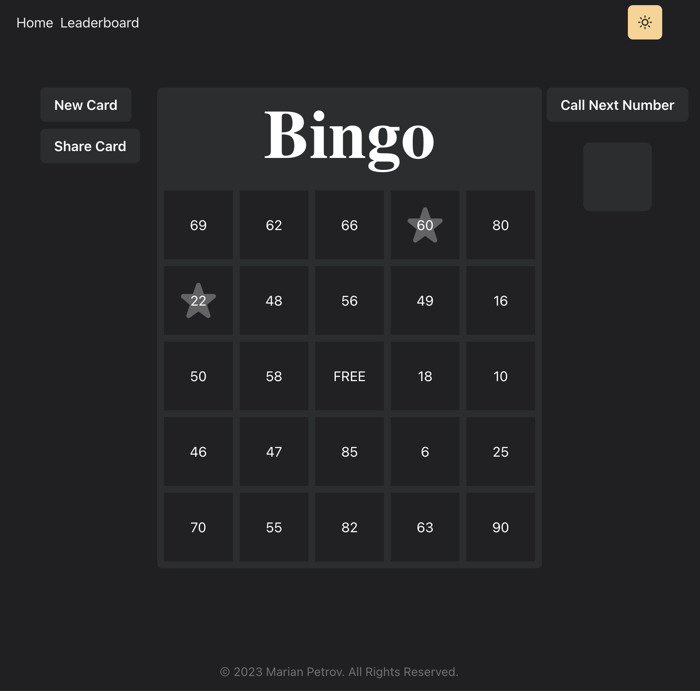
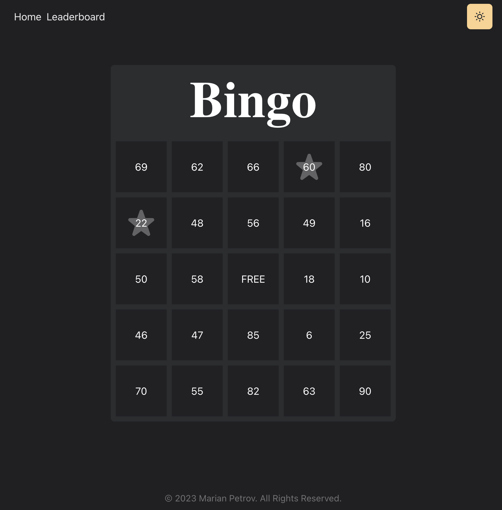
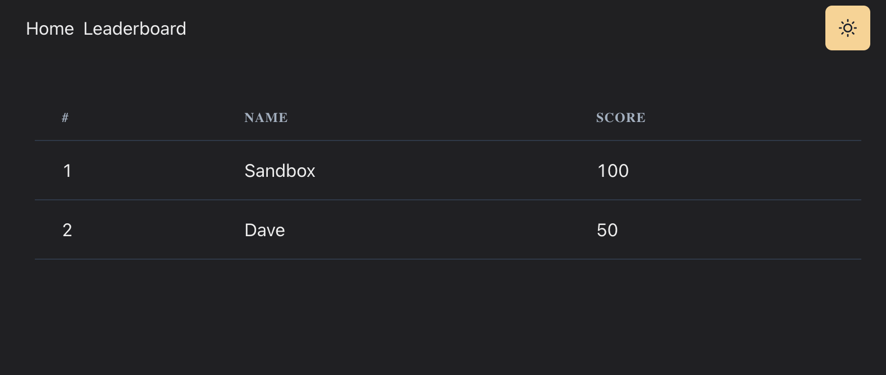
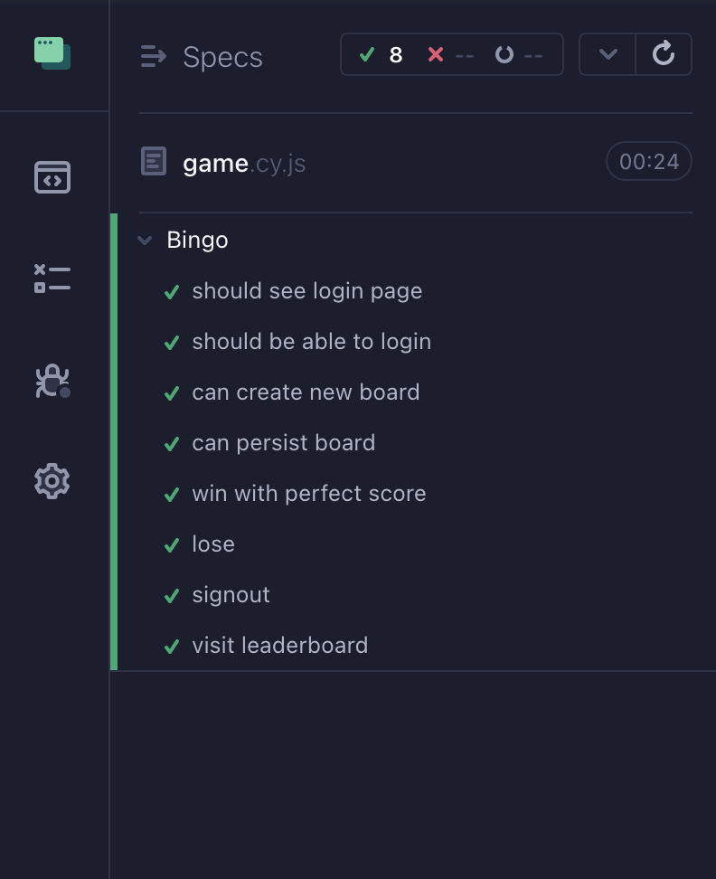

# Bingo

## Live preview

[https://game-bingo.vercel.app/](https://game-bingo.vercel.app/)

## Screenshots

Board display durring play
# 

Shared card display
# 

Leaderboard display
# 

Available E2E tests with Cypress
# 

## Instructions

- clone and follow the instructions how to start the backend server [https://github.com/bashcole/bingo-api/](https://github.com/bashcole/bingo-api/)
- create a `.env.local` file using `.env.example` as template
- change the backed API url inside `env.local`
- `npm install` to install dependencies
- `npm run dev` to start the application
- `npx cypress open` to open Cypress window and test the application
